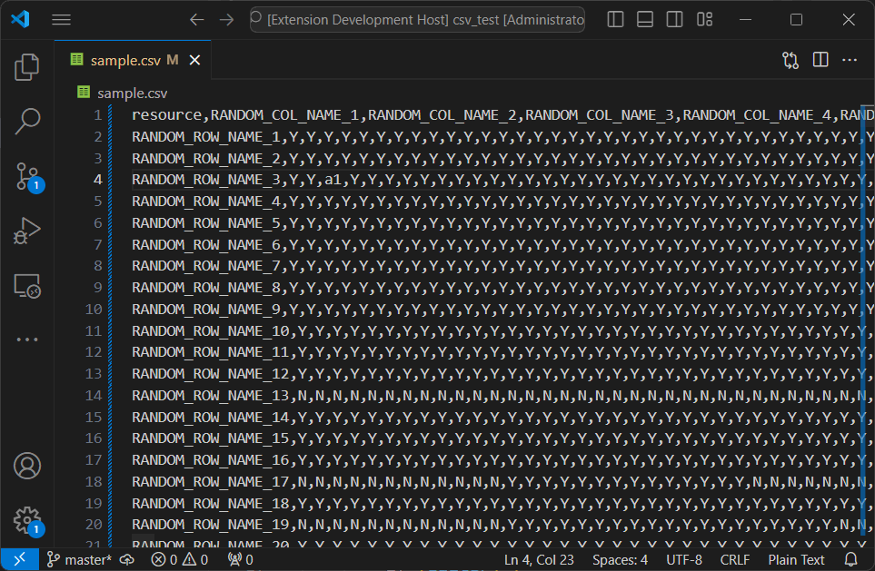

# CSV-Manipulate

Get/Set a cell's value in a csv file using row/column names. For now, only separator ',' is supported.

# Demo

# Usage
`ctrl+shift+p` and type `get cell` or `set cell`. You will be prompted to input `row-name, col-name [,target-value]`. Note that the row name, col name, target value will be trimmed first.