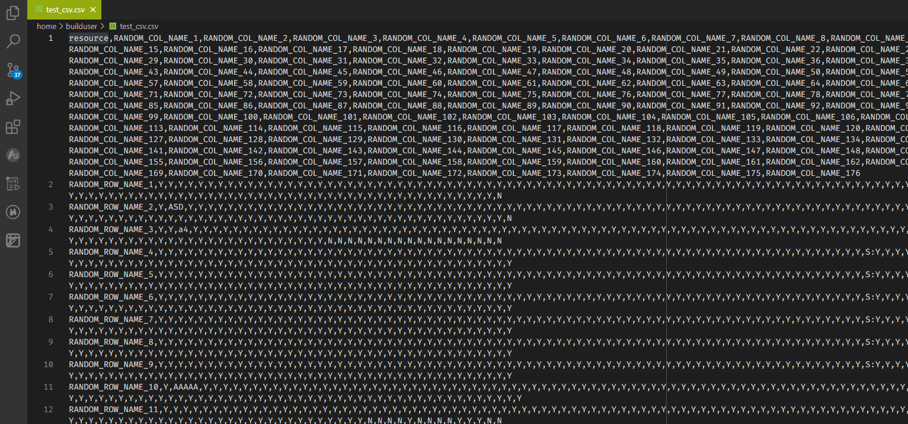

# 使用方法
这个插件的作用是，给定行名和列名，查找/修改对应的格子。

## 行名
决定了需要找哪一行。比如想要匹配上aa, bb, cc这一行，则行名应该填aa。

## 列名
决定了需要找哪一列。

## 搜索第x行，默认为1
即：插件会在哪一行查找对应列名。默认会搜索第一行，查找到对应列名。

## 搜索第y列，默认为1
即：插件会在哪一列查找对应行名。默认会搜索第一列，也就是上面例子中展示的。

## 多个匹配
如果找到多个匹配，会绘制成表格展示。有多个匹配时无法进行Set操作。

# CSV-Manipulate

Get/Set a cell's value in a csv file using row/column names.

# Demo

## GUI

# Usage

1. GUI available now. Click the sidebar icon and enjoy.

# Options
There are several tunable options controlling the behavior of the extension, check details in the extension settings page.

# Roadmap
| Feature    | Offered |
| -------- 	 | ------- |
|1. Settings page, to control trim enabled, separator other than ',' etc. 	|	✅|
|2. GUI support(maybe?)													 	|	✅|
|3. Support modify csv file by any row/col, besides 1st row/col.			|	✅|
|4. Keep last executed command												|	✅|
|5. Partial match and case sensitivity										|	✅|
|6. Fuzzy search															|	❌|
|7. Move cursor to target after getting/setting								|	✅|
|8. Autocomplete															|	❌|
|9. Find all matches.                                                       |   ✅|

# Changelog

## v0.1.1
1. *Breaking change:* Now the extension will complain when it finds multiple matches.
2. *Breaking change:* Remove CLI.
3. Move `partialMatch` option to the sidebar panel.